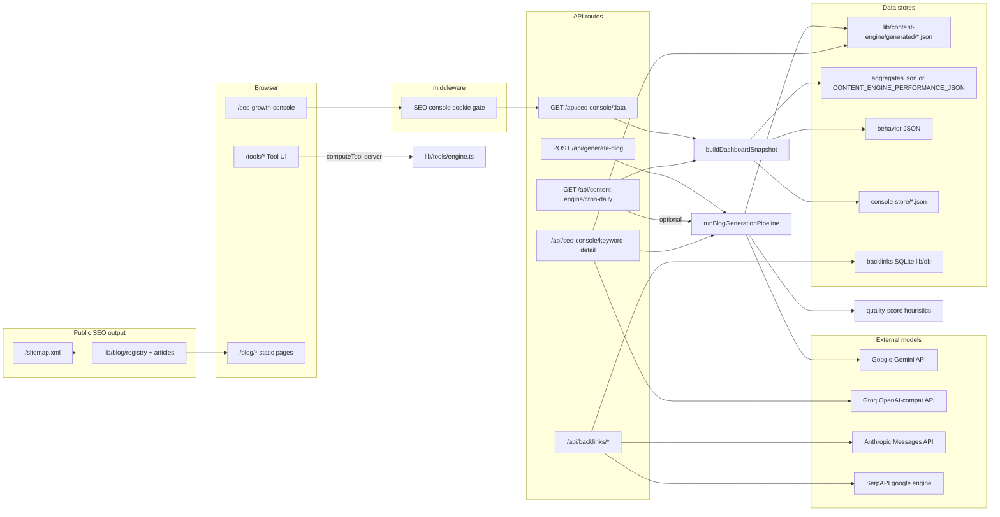

# Toollabz - Complete AI System Flow Audit (Engineering)

**Scope:** Code paths only. “AI” below means **LLM or external model API** unless explicitly labeled heuristic/template.  
**Date:** 2026-05-15

---

## Part 1 - Inventory of all AI-related features

| # | Feature / system | Location (primary) | Purpose | Status | Production readiness |
|---|-------------------|----------------------|---------|--------|------------------------|
| 1 | **Blog draft pipeline (Gemini)** | `lib/content-engine/llm-blog.ts`, `pipeline.ts`, `POST /api/generate-blog`, `POST /api/seo-console/keyword-detail`, `POST /api/seo-console/action` (`generate_blog`) | Long-form JSON blog draft (title, meta, slug suggestion, markdown, FAQ JSON) | **Real LLM** when `GEMINI_API_KEY` set | **Production-capable** with keys, rate limits, and human review before publish |
| 2 | **Tool spec enrichment (Groq)** | `lib/content-engine/llm-groq.ts`, `generateToolSpecWithGroq`, `enrichToolProposalSpecWithGroq`, auto-gen | Short structured JSON for tool proposals | **Real LLM** when `GROQ_API_KEY` set; **no-op passthrough** if unset/fails | **Partial**: outputs still need `computeKey` / real engine implementation |
| 3 | **Auto-generation (blog + tool artifact)** | `lib/content-engine/auto-generation.ts`, cron when flags set | Saves Gemini blog + Groq tool spec to `keyword-artifact-store` | **Hybrid** (LLM + file persistence) | **Infrastructure-dependent**: needs keys + writable `generated/` |
| 4 | **Daily cron planning endpoint** | `GET /api/content-engine/cron-daily` | Discovery, queues, markdown action doc; **optional** LLM batch | **Heuristic** by default; LLM only if `CONTENT_ENGINE_CRON_ENABLED` + `CONTENT_ENGINE_CRON_GENERATE` + `CONTENT_ENGINE_AUTO_GENERATE_HIGH_PRIORITY` | **Ops-ready** as reporting hook; **risky** if auto-generate enabled without governance |
| 5 | **Opportunity / keyword engine** | `lib/content-engine/opportunity-engine.ts`, `keyword-intelligence.ts`, `monetization/cpc-scoring.ts` | Harvest keywords from tools, categories, editorial lists, long-tail variants; score & prioritize | **Rule-based heuristics** | **Stable** for internal prioritization; **not** semantic “AI discovery” |
| 6 | **Performance + cluster enrichment** | `lib/content-engine/performance/enrich-priorities.ts`, `gsc-merge.ts`, `behavior-priority.ts` | Re-rank opportunities using imported GSC JSON + behavior JSON + static cluster ids | **Heuristic merge** on optional files | **Production** if you maintain aggregate imports |
| 7 | **Topic clusters** | `lib/content-engine/topic-clusters.ts` | Map keywords to pillar tools + supporting titles | **Static curated config** | **Production** as editorial taxonomy; **not** ML clustering |
| 8 | **Cluster performance snapshot** | `lib/content-engine/dashboard/cluster-performance.ts` | Dashboard rows: leaderboard / growth / declining | **Heuristic** over aggregates (or synthetic-ish when data thin) | **Dashboard truth** = quality of input JSON |
| 9 | **Internal link suggestions (blog pipeline)** | `lib/content-engine/internal-linking.ts`, `funnel/authority-links.ts` | Token overlap scoring vs tools + posts; cluster pillar + hub-keyword match | **Deterministic string/token overlap** | **Production** as assistive suggestions; not embeddings |
|10| **Blog quality score** | `lib/content-engine/quality-score.ts`, `performance/weights-loader.ts` | Gate auto-publish intent | **Heuristic** (length, headings, robotic phrases, keyword in intro, etc.) | **Production** as guardrail; not a learned model |
|11| **Intent stage / funnel addenda** | `lib/content-engine/funnel/*.ts` | Extra system text appended to Gemini prompt | **Template rules** (`detectIntentStage`, etc.) | **Production** as prompt shaping |
|12| **Behavior-driven prompt hints** | `pipeline.ts` + `growth/load-behavior-aggregates.ts` | If `behaviorPath` + enough samples, append first-party hints | **Hybrid**: statistics → text instructions → **LLM** | **Production** only if behavior JSON maintained |
|13| **CTR / SERP variant suggestions** | `lib/content-engine/growth/ctr-suggestions.ts` | A/B/C title+meta ideas for low-CTR URLs from GSC metrics | **Template strings** from path slug; thresholds on impressions/CTR | **Editorial assist**; **negligible automatic SEO** unless humans ship changes |
|14| **Competitor intelligence** | `lib/content-engine/competitor/intelligence.ts`, `fetch-page.ts`, `compare.ts` | Fetch competitor HTML, extract headings, compare overlap | **Real HTTP fetch** + **string heuristics**; **no LLM** in compare | **Prototype-to-beta**: fragile vs site changes, anti-bot |
|15| **SEO ranking / optimization rows** | `lib/content-engine/seo-ranking-engine.ts` | Read/write `seo-rankings.json`, `gsc-data.json`, actions | **File-backed**; rows may be `gsc` or **`synthetic`** per type | **Depends on import pipeline** (GSC service account elsewhere in file) |
|16 | **Sitemap ping** | `lib/content-engine/google-indexing.ts` | GET Google ping URL for sitemap | **HTTP fetch** to Google | **Low leverage** (hint only); no ranking guarantee |
|17 | **Backlink outreach content (Claude)** | `lib/backlinks/anthropic-generate.ts`, `run-content-generation.ts`, `POST /api/backlinks/generate-content` | Guest post / email JSON from Anthropic Messages API | **Real LLM** (`ANTHROPIC_API_KEY`) | **Production-capable** with keys + DB prospects |
|18 | **SerpAPI prospect discovery** | `lib/backlinks/serp-search.ts` | Organic results for query seeds | **External API** (not LLM) when `SERPAPI_KEY` | **Operational** if key present; empty array if not |
|19 | **Tool FAQs (expansion)** | `lib/tools/faq-expansion.ts`, `getToolFaqs` in `lib/tools/content.ts` | Deterministic long-tail FAQ variants merged/capped | **Template + slug-seeded variation** (`pickBySlug`, `slugContentVariant`) | **Production** on shipped pages; **not** LLM |
|20 | **“AI” branded calculators (site tools)** | `lib/tools/engine.ts` cases `ai-*` | User-facing copy helpers | **Template / regex heuristics in-process** - **no network LLM** | **Production** as UX utilities; **misleading if marketed as “AI model”** |
|21 | **SEO Growth Console snapshot** | `lib/content-engine/dashboard/build-dashboard-snapshot.ts` | Aggregates dozens of sub-engines into one JSON | **Mostly heuristics** + optional files | **Internal command center**; not autonomous SEO |
|22 | **Console actions (shell scripts)** | `app/api/seo-console/action/route.ts` | `execSync` npm `content-engine:*` scripts | **Process spawn**; not model inference | **Dev/CI oriented**; production needs locked-down runner |

**Additional “AI” slugs in `lib/tools/data.ts` (all implemented in `computeTool` / `engine.ts` as templates unless noted above):**  
`ai-email-subject-line-generator`, `ai-cold-email-generator`, `ai-linkedin-post-generator`, `ai-resume-summary-generator`, `ai-product-description-generator`, `ai-content-humanizer`, `ai-prompt-optimizer`, `ai-social-bio-generator`, `ai-search-appearance-checker`, `ai-citation-checker` - **none** call Gemini/Groq/Anthropic/OpenAI from `engine.ts`.

---

## Part 2 - How each real / hybrid system works (implementation detail)

### A. Blog generation (Gemini) - `generateBlogDraft` → `runBlogGenerationPipeline`

| Stage | Detail |
|-------|--------|
| **Trigger** | `POST /api/generate-blog` (requires `assertContentEngineAuthorized`), SEO console `action: generate_blog`, keyword-detail `regenerate_blog`, `auto-generation.generateForKeyword`, cron `runHighPriorityAutoGeneration` when env flags on |
| **Input** | `topic`, `primaryKeyword`, optional `variationSeed`, `intentStage`, `behaviorPath`, `highIntentMode` |
| **Processing** | `pickVariationProfile` → `detectIntentStage` (regex) → optional `loadBehaviorAggregates` slice → concatenate **systemInstruction** string (writer persona + JSON-only + `highValueCommercialIntentAddendum` + funnel addenda) + **user** string (topic, keyword, length band) |
| **Model** | Google **Gemini** REST: `POST https://generativelanguage.googleapis.com/v1beta/models/{GEMINI_MODEL}:generateContent` with `x-goog-api-key`, `responseMimeType: application/json`, `temperature: 0.65` |
| **Prompt structure** | System: multi-line instructions including “Return ONLY valid JSON” + keys `seoTitle, metaDescription, slugSuggestion, bodyMarkdown, faqSchema`. User: topic + keyword + optional funnel block |
| **Output parse** | `geminiPartsText` → `extractJsonObject` (brace slice) → validate required strings; `faqSchema` array normalized |
| **Post-LLM** | `scoreBlogDraft` (heuristic), `findClusterForKeyword` (static table), `suggestAuthorityAugmentedLinks` (overlap + cluster), `enforceBlogMonetization`, optional `adsenseScan` |
| **Persistence** | Pipeline **returns** object; persistence is via **callers**: `saveKeywordBlogArtifact` writes under `CONTENT_ENGINE_GENERATED_DIR` (default `lib/content-engine/generated`), updates `keywords.json` index |
| **Caching** | None in `llm-blog.ts`; route `dynamic = "force-dynamic"` |
| **Errors** | Missing key → throw / HTTP 503 on public route; Gemini HTTP → thrown with body snippet |

### B. Tool spec (Groq) - `generateToolSpecWithGroq` / `enrichToolProposalSpecWithGroq`

| Stage | Detail |
|-------|--------|
| **Trigger** | Auto-gen after blog; keyword-detail `regenerate_tool` / `regenerate_all` |
| **Input** | Keyword, slug, name, category → base spec with `computeKey: "REPLACE_WITH_ENGINE_KEY"` |
| **Model** | **Groq** OpenAI-compatible: `https://api.groq.com/openai/v1/chat/completions`, `Authorization: Bearer`, `response_format: { type: "json_object" }`, model `GROQ_MODEL` |
| **Prompt** | System: merge-only JSON keys for descriptions/keywords/fields; user: JSON of current spec |
| **Fallback** | If no key or exception → **returns original spec** (silent in `enrichToolProposalSpecWithGroq`) |
| **Persistence** | `saveKeywordToolArtifact` → JSON files + index |

### C. Backlink content (Anthropic)

| Stage | Detail |
|-------|--------|
| **Trigger** | `generateContentForProspect` from API routes under `app/api/backlinks/*` when prospect DB row valid |
| **Input** | Prospect row from `lib/db/backlinks-db` (SQLite), category → `pickToolForCategory`, prompt builders in `lib/backlinks/prompts.ts` |
| **Model** | `https://api.anthropic.com/v1/messages`, `ANTHROPIC_MODEL` default `claude-sonnet-4-20250514`, `max_tokens: 8192` |
| **Output** | `callClaudeJson` → `parseJsonObject` → structured fields + `buildContentQualityWarnings` heuristics |
| **Persistence** | `upsertContent` / `updateProspect` in backlinks DB |

### D. SerpAPI (not LLM)

| Stage | Detail |
|-------|--------|
| **Trigger** | Prospect / discovery flows calling `serpApiSearch` |
| **Behavior** | If `SERPAPI_KEY` unset → **returns []** (no error surface in helper) |
| **Output** | Organic result objects |

### E. Opportunity engine + enrichment (no LLM)

| Stage | Detail |
|-------|--------|
| **Trigger** | `discoverKeywordOpportunities` on cron, snapshot build, tests |
| **Input** | `tools` keywords, category labels, `TRAFFIC_PHASE_BLOG_IDEAS`, long-tail string templates |
| **Logic** | Regex intent (`TRANSACTIONAL_HINTS`), monetization regex boosts, `topicBucket`, dedupe, `computeCpcProxyScore` / `computeMonetizationPotential` from word lists |
| **GSC influence** | Only if `loadPerformanceAggregates()` returns parsed `pages` / `pageRevenue` - then `applyGscBoostToPrioritized` etc. |
| **Persistence** | In-memory per request unless downstream saves artifacts |

### F. CTR queue (no LLM)

| Stage | Detail |
|-------|--------|
| **Logic** | For each `GscPageMetric`, if impressions ≥ 800, CTR < 2.2%, clicks ≥ 2, and path is `/blog/` or `/tools/`, emit three **fixed-pattern** title/meta variants derived from slug words (`slugToPhrase`) |
| **Output** | Used in growth markdown / dashboard; **not auto-written** to pages |

### G. FAQ expansion (no LLM)

| Stage | Detail |
|-------|--------|
| **Logic** | `longTailPack` builds FAQ objects from tool metadata + `pickBySlug` rotating templates; `dedupeFaqs`; cap at `FAQ_CAP` (8) |
| **Render** | `getToolFaqs` merges static tool FAQs + expansion at **request/build** time for pages |

### H. “AI” tools in `engine.ts` (no LLM)

Each case: validate form → string templates / `Math.random` for variants (`ai-content-humanizer`) → return `{ title, value, extra }`. **No fetch to model providers.**

---

## Part 3 - Classification table (brutal)

| System | Classification |
|--------|----------------|
| Gemini blog draft | **Real AI / LLM** |
| Groq tool spec | **Real AI / LLM** (optional; degrades to stub) |
| Anthropic outreach content | **Real AI / LLM** |
| SerpAPI search | **External deterministic API** (not “AI”) |
| Opportunity engine | **Rule-based heuristics** |
| Cluster assignment (`findClusterForKeyword`) | **Static / manual taxonomy** |
| Cluster performance dashboard | **Heuristic scoring** on metrics |
| Internal link suggesters | **Heuristic (token overlap)** |
| Quality score | **Heuristic** |
| CTR A/B/C suggestions | **Static templates** gated by thresholds |
| Competitor fetch/compare | **Hybrid: real fetch + heuristic compare** (no LLM) |
| FAQ expansion | **Rule-based templates** |
| AI-* slug tools (email, humanizer, etc.) | **Static/demo templates** (regex for citation checker) |
| SEO console PR scripts | **Placeholder / ops hooks** (shell out) |
| Sitemap ping | **Simple HTTP** |

---

## Part 4 - Content engine (blogs) - deep

| Question | Answer |
|----------|--------|
| How are blogs generated? | **On demand** via `runBlogGenerationPipeline` → Gemini JSON → optional save to `keyword-artifact-store`. **Shipped** blog articles in `lib/blog/articles/*.tsx` are **hand-authored TSX** in repo; the engine produces **drafts/artifacts**, not automatic route publication. |
| Prompts / templates? | Yes: `llm-blog.ts` system block; `variation.ts`; `funnel/*Addendum`; `monetization/content-intent-prompt.ts` |
| OpenAI / Anthropic for blogs? | **No** in blog path. **Gemini only** for blog JSON. |
| Prebuilt / manual? | **Yes** - production blog is registry + manifest. |
| Programmatic SEO? | **Separate**: programmatic routes/sitemap entries from `lib/sitemap-programmatic`, `generatedPaths` in `sitemap-data.ts` reading `keywords.json` **suggestions** - not the same as auto-publishing Gemini output. |
| Semantic expansion? | **No embeddings**. “Semantic” behavior is **keyword substring** match to `TOPIC_CLUSTERS` + token overlap links. |
| FAQ generation | **Inside Gemini JSON** (`faqSchema` array) **plus** on-site tool FAQs from **template** expansion (`faq-expansion.ts`). |
| Internal link selection | **After** generation: `suggestAuthorityAugmentedLinks` → pillar tool link + up to 3 blogs whose title/description match cluster `hubKeywords` + `suggestInternalLinks` overlap |

---

## Part 5 - Cluster engine - deep

| Question | Answer |
|----------|--------|
| How built? | **`TOPIC_CLUSTERS` constant**: each row has `id`, `pillarToolSlug`, `hubKeywords[]`, `supporting[]` with title/keyword strings. |
| Embeddings? | **No.** |
| Cosine / vector DB? | **No.** |
| Static / manual? | **Yes**, fully hand-curated in source. |
| GSC influence on **cluster definition**? | **No** - GSC influences **priority scores** and performance snapshots, not cluster membership algorithm (membership is keyword match to hub strings / tool slugs). |
| Semantic grouping? | **Only colloquial** - substring / overlap, not vector semantics. |
| Opportunity scoring | `opportunity-engine` + `enrich-priorities` + CPC proxies + optional GSC boosts + behavior boosts + console flags (`businessMode`, `revenueBoostMode`, `activeClusterIds`). |

---

## Part 6 - Automation engine

| Mechanism | What it does | LLM? |
|-----------|----------------|------|
| `GET /api/content-engine/cron-daily` | If `CONTENT_ENGINE_CRON_ENABLED`, logs; builds opportunities, queues, growth markdown, topic cluster summaries; **optionally** `runHighPriorityAutoGeneration` when `CONTENT_ENGINE_CRON_GENERATE=1` and `CONTENT_ENGINE_AUTO_GENERATE_HIGH_PRIORITY` | **Only if** that branch runs → Gemini+Groq per keyword |
| `POST /api/seo-console/action` | `run_pr_script` → `execSync` npm scripts; `generate_blog` → pipeline | Scripts = no; blog = yes |
| Next **ISR/revalidate** | Blog/tool pages use `revalidate` exports - **standard Next**, not LLM-driven |
| Sitemap | `app/sitemap.xml/route.ts` + `buildSitemapEntries` - deterministic | No |
| SEO checks in engine | `detectSiteHealthIssues`, `adsenseReadiness`, etc. - **rules** on snapshot inputs | No |

**There is no Redis/Bull queue** for content jobs in the audited paths.

---

## Part 7 - Data flow map (Mermaid)

---

## Part 8 - Environment + dependencies

### AI / LLM-related env vars (non-exhaustive of entire monorepo; focused on audited flows)

| Variable | Used by |
|----------|---------|
| `GEMINI_API_KEY` | `llm-blog.ts` - **required** for blog LLM |
| `GEMINI_MODEL` | Default `gemini-2.0-flash` |
| `GROQ_API_KEY` | `llm-groq.ts` |
| `GROQ_MODEL` | Default `llama-3.1-8b-instant` |
| `ANTHROPIC_API_KEY` | `anthropic-generate.ts` |
| `ANTHROPIC_MODEL` | Default `claude-sonnet-4-20250514` |
| `SERPAPI_KEY` | `serp-search.ts` |
| `CONTENT_ENGINE_SECRET` / `CRON_SECRET` | Cron + some internal fetches |
| `TOOLLABZ_SEO_CONSOLE_SECRET` | Console cookie auth (not LLM) |
| `CONTENT_ENGINE_CRON_ENABLED` | Cron gate |
| `CONTENT_ENGINE_CRON_GENERATE` | Allows auto LLM batch in cron |
| `CONTENT_ENGINE_AUTO_GENERATE_HIGH_PRIORITY` | Filters which rows auto-run |
| `CONTENT_ENGINE_PERFORMANCE_JSON` | GSC-like aggregates path |
| `CONTENT_ENGINE_BEHAVIOR_JSON` | Behavior aggregates |
| `CONTENT_ENGINE_GENERATED_DIR` | Keyword artifacts output |
| `CONTENT_ENGINE_CONSOLE_STORE_DIR` | Admin JSON |
| `GOOGLE_SERVICE_ACCOUNT_*`, `GSC_SITE_URL` | `seo-ranking-engine.ts` paths (GSC ingestion - separate from Gemini blog) |

### NPM / runtime dependencies (AI-facing)

| Package / API | Role |
|---------------|------|
| **None of `@google/generative-ai`, `openai`, `@anthropic-ai/sdk`** required in audited files - calls use **`fetch`** | Minimal SDK footprint |
| `better-sqlite3` | **Backlinks DB**, not Gemini |

### Unused / overstated risk

- **Marketing label “AI tools”** on site: many are **pure templates** in `engine.ts`. SDK absence confirms no unified “AI SDK layer” for those tools.

### Missing production infrastructure (for “true AI SEO OS”)

- **No async job queue** with retries/idempotency for LLM calls  
- **No centralized prompt registry / eval harness**  
- **No embedding index** for semantic clustering or RAG over crawl  
- **No automated publish pipeline** from artifact → live route without human PR  
- **Multi-instance file write** contention on JSON stores  

---

## Part 9 - SEO impact (per feature type)

| Feature class | Ranking / CTR / indexing impact | Level |
|---------------|----------------------------------|-------|
| Shipped static blogs + structured data + internal links (editorial) | **Real** leverage when content quality + crawlability are good | **High** (non-AI-specific) |
| Gemini drafts **not merged to routes** | **None** until published | **Negligible** |
| Heuristic opportunity dashboard | **None** on Google directly | **Low** (internal planning) |
| Static topic clusters in scoring | **Indirect** - helps humans prioritize internal linking topics | **Medium** (process) |
| Token-overlap internal link suggestions in pipeline | **Low–medium** if editor implements links on live pages | **Medium** |
| CTR template suggestions | **Medium** only if deployed to titles/metas and measured | **Low** as code-only |
| Sitemap ping | **Low** (hint) | **Low** |
| SerpAPI + outreach + Claude content | **Medium** if used ethically and links earned | **Medium** (off-page, risky) |
| Template “AI” tools | **Negligible SEO**; UX / engagement only | **Negligible** |
| FAQ template expansion | **Low–medium** for rich results eligibility **if** page FAQ schema aligned | **Medium** |

---

## Part 10 - Next phase recommendations (engineering)

1. **Rename or disclose** `ai-*` tools that are template engines - avoid implying frontier models.  
2. **Make “real AI” paths observable**: log model id, latency, token usage (where APIs allow), redact PII.  
3. **If you want semantic clustering**: add **embeddings + vector store** (or hosted search) - **do not** relabel `TOPIC_CLUSTERS` as ML.  
4. **Promotion pipeline**: artifact → human review → PR → merge; avoid silent `generatedPaths` in sitemap without 200 HTML.  
5. **Queue workers** for `generate_blog` / `run_pr_script` instead of `execSync` in serverless.  
6. **Unify secrets model**: cron vs console vs outreach - document who can call what.  
7. **Real SEO growth** still comes from **publishable content + crawl + links + CWV** - LLM drafts are **inputs**, not outcomes.

---

## Appendix - “AI” tool slugs: implementation type (quick reference)

All implemented in **`lib/tools/engine.ts`** as **in-process string logic** except where noted:

- `ai-email-subject-line-generator` - template subject + extras  
- `ai-cold-email-generator` - paragraph template  
- `ai-linkedin-post-generator` - hook + bullet structure  
- `ai-resume-summary-generator` - single paragraph from fields  
- `ai-product-description-generator` - paragraph from fields  
- `ai-content-humanizer` - wraps pasted text with lead phrases + `Math.random` variant selection  
- `ai-prompt-optimizer` - four static “optimized” prompt shells  
- `ai-social-bio-generator` - four bio hooks with platform string  
- `ai-search-appearance-checker` - four static “SERP plan” strings  
- `ai-citation-checker` - **regex + hand-tuned scoring** of URLs, DOI-like patterns, vague phrases  

**None** invoke Gemini/Groq/Anthropic/OpenAI.

---

*End of audit.*
