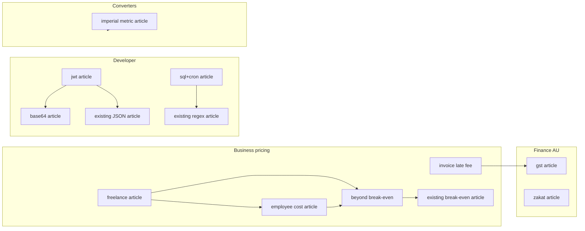

# Blog cluster SEO - priority, keywords, and internal linking (Toollabz expansion)

**Purpose:** Editorial map for new high-intent posts supporting recently shipped tools. Posts are written for humans first; keywords anchor sections, not filler intros.

---

## Publication priority (ship order)

| Priority | Article slug (new) | Primary intent | Why this order |
|----------|-------------------|----------------|----------------|
| P1 | `jwt-token-decode-vs-verify-security-guide-toollabz` | JWT decode vs verify | High developer search volume; strong link hub to JSON + timestamps |
| P2 | `gst-australia-inclusive-exclusive-10-percent-small-business` | GST inclusive vs exclusive AU | Clear commercial intent; pairs with existing VAT thinking |
| P3 | `freelance-pricing-hourly-day-rate-mistakes-calculator-guide` | Freelance hourly vs day rate | Bridges two calculators; monetization-adjacent |
| P4 | `zakat-calculation-nisab-practical-guide-respectful` | How zakat is calculated | Sensitive topic - careful tone; long dwell if done well |
| P5 | `sql-cron-readability-schedulers-developer-guide-toollabz` | SQL formatting + cron fields | One hub for two lightweight tools; devops overlap |
| P6 | `base64-encoding-url-apis-jwt-fragments-developer` | Base64 for APIs and JWT | Complements JWT post without cannibalizing if angles differ |
| P7 | `employee-loaded-cost-pricing-seat-economics-toollabz` | Fully loaded employee cost | B2B pricing searches; links break-even + margin content |
| P8 | `invoice-late-fee-simple-interest-contracts-toollabz` | Invoice late fee calculator | Legal-adjacent; clear CTA; pairs GST/VAT |
| P9 | `beyond-break-even-contribution-margin-profit-path` | After break-even profitability | Extends existing break-even article without duplicating slug |
| P10 | `imperial-metric-stone-feet-acres-hectares-conversion-guide` | Stone to kg, feet to cm, acres to hectares | One strong “UK/US ↔ metric” landing; three tool CTAs |

---

## Target keyword (one primary per article)

| Slug | Primary keyword phrase |
|------|-------------------------|
| `jwt-token-decode-vs-verify-security-guide-toollabz` | JWT decode vs verify |
| `gst-australia-inclusive-exclusive-10-percent-small-business` | GST inclusive vs exclusive Australia |
| `freelance-pricing-hourly-day-rate-mistakes-calculator-guide` | Freelance hourly vs day rate |
| `zakat-calculation-nisab-practical-guide-respectful` | Zakat calculation nisab |
| `sql-cron-readability-schedulers-developer-guide-toollabz` | SQL formatter online + cron expression |
| `base64-encoding-url-apis-jwt-fragments-developer` | Base64 encode decode API |
| `employee-loaded-cost-pricing-seat-economics-toollabz` | Employee loaded cost calculator |
| `invoice-late-fee-simple-interest-contracts-toollabz` | Invoice late fee calculator |
| `beyond-break-even-contribution-margin-profit-path` | Contribution margin after break even |
| `imperial-metric-stone-feet-acres-hectares-conversion-guide` | Stone to kg, feet inches to cm, acres to hectares |

---

## Cluster relationships

---

## Internal linking (minimum pattern per post)

Each new article includes **≥8 contextual** `Link` hrefs to:

- Its primary `/tools/{slug}` (often via `BlogToolCallout` + inline)
- **Hubs:** `/developer-tools`, `/finance-tools`, `/business-tools`, `/tools` as appropriate
- **Related blogs:** 3–6 `relatedPostsSlugs` that already exist (regex guide, JSON article, break-even, VAT, markup/margin, salary, etc.)

---

## Supporting related tools (by article)

| Article | `relatedToolSlugs` (primary cluster) |
|---------|----------------------------------------|
| JWT | `jwt-decoder`, `json-validator`, `unix-timestamp-converter`, `base64-encoder-decoder`, `regex-tester` |
| GST AU | `gst-calculator-australia`, `vat-calculator`, `invoice-late-fee-calculator`, `profit-margin-calculator-business` |
| Freelance pricing | `freelance-rate-calculator`, `freelance-day-rate-calculator`, `employee-cost-calculator`, `break-even-calculator` |
| Zakat | `zakat-calculator`, `currency-converter`, `net-worth-calculator`, `emergency-fund-calculator` |
| SQL + cron | `sql-formatter`, `cron-expression-generator`, `unix-timestamp-converter`, `json-validator` |
| Base64 | `base64-encoder-decoder`, `url-encoder-decoder`, `jwt-decoder`, `json-validator` |
| Employee cost | `employee-cost-calculator`, `meeting-cost-calculator`, `break-even-calculator-business`, `profit-margin-calculator` |
| Invoice late fee | `invoice-late-fee-calculator`, `gst-calculator-australia`, `vat-calculator`, `discount-calculator` |
| Beyond break-even | `break-even-calculator`, `break-even-calculator-business`, `profit-margin-calculator-business`, `roi-calculator` |
| Imperial metric | `stone-to-kg-converter`, `feet-inches-to-cm-converter`, `acres-to-hectares-converter`, `cm-to-feet`, `kg-to-lbs` |

---

## SEO warnings (non-negotiables)

- **JWT / Base64:** Never imply decoding equals trust; no “verify signature” claims unless describing server-side steps.
- **Zakat / GST / late fees:** Educational only; defer rulings, filings, and enforceability to qualified professionals.
- **Converters:** Call out US survey acre vs international acre where relevant (deed vs blog math).

---

## Thin-content avoidance checklist (editorial QA)

- [ ] Opening paragraph states a concrete problem, not “In today’s digital world…”
- [ ] At least one numeric or scenario walk-through per major H2
- [ ] Comparison table or bullet contrast where readers confuse two concepts
- [ ] FAQ entries pulled from real confusion patterns (support, Reddit, tax forums) - paraphrased
- [ ] `commonMistakes` tied to wrong math or wrong workflow, not vague “don’t forget”
