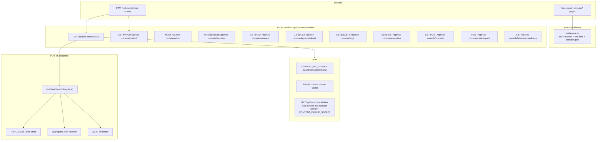

# Toollabz AI SEO Growth Console - Engineering Audit

**Date:** 2026-05-15  
**Scope:** Code-verified behavior only. No marketing claims.

---

## Executive summary

| Item | Finding |
|------|---------|
| **“Failed to load Clusters - Unauthorized”** | **Root cause:** `middleware.ts` returned `NextResponse.next()` for **all** `localhost` / `127.0.0.1` / `[::1]` / `*.local` hosts **before** the SEO Growth Console auth block. UI routes under `/seo-growth-console` were reachable **without** a session cookie, while `GET /api/seo-console/data` still required `assertDashboardDataAuthorized` → **401** with `{ error: "Unauthorized." }`. SWR surfaces that as `Failed to load {section}` - Clusters is not special; any section using the same fetcher fails identically. |
| **Fix applied** | Removed the early return so **HTTPS/www skipping** still applies on local hosts (via `shouldEnforceHttpsAndWww`), but **dashboard auth + API rate limits** now run on localhost too. Users are redirected to `/seo-growth-console/login`; after POST `/api/seo-console/session`, the `tlz_seo_console` cookie is sent with `credentials: "include"` fetches. |
| **Clusters “engine”** | **No vector DB, no embeddings, no SQL tables for clusters.** `TOPIC_CLUSTERS` in `lib/content-engine/topic-clusters.ts` is a **static** curated list (ids, pillar tool slugs, hub keyword strings). `clusterPerformance` in the dashboard snapshot comes from **deterministic/heuristic** scoring over optional GSC-like JSON (`loadPerformanceAggregates`) - if that file is missing, scores are still produced from fallbacks inside `buildClusterPerformanceSnapshot`. |
| **“AI” honesty** | **Real LLM paths** exist for `generate_blog` (`runBlogGenerationPipeline` → Gemini/Groq when keys set). Most dashboard numbers are **synthesized from rules + optional imported JSON + repo counts**, not a live model interpreting your site in real time. |
| **Persistence** | JSON files under `lib/content-engine/` (e.g. `console-store/`, `outreach/outreach-queue.json`, optional `aggregates.json`). **No Postgres/Supabase/Prisma** in `lib/content-engine`. |

---

## 1. Architecture map (verified)



---

## 2. Module-by-module status

All section pages under `/seo-growth-console/*` (except login) use **`SeoConsoleSectionPage`** or **`SeoGrowthConsoleDashboard`** + **`SeoGrowthConsoleLayoutShell`**. Data for most sections comes from **one** endpoint: **`GET /api/seo-console/data`** → `buildDashboardSnapshot()`. If that GET returns 401, **every** section that depends on `snapshot` shows the same failure pattern.

| Module (nav label) | Route | Data source | Functional? | Notes |
|--------------------|-------|---------------|---------------|-------|
| **Overview** | `/seo-growth-console` | `SeoGrowthConsoleDashboard` → `/api/seo-console/data`, `/api/seo-console/control`, `/api/seo-console/logs` | **Yes** after auth fix | Charts: `ConsoleCharts` dynamic `ssr: false`. |
| **Opportunities** | `.../opportunities` | Same `snapshot.opportunityEngine` | **Yes** | Table + keyword modal → `/api/seo-console/keyword-detail` (cookie auth only). |
| **Content Engine** | `.../content-engine` | `snapshot.opportunityEngine.blogIdeas` | **Partial** | Rows mostly from engine; some buttons call generic `run_audit` / `run_pr_script` - not a full CMS. |
| **Tool Engine** | `.../tool-engine` | `snapshot.opportunityEngine.toolIdeas` | **Partial** | “Approve” shells out npm scripts (`content-engine:tool-proposal-pr`); requires working env + git. |
| **Revenue** | `.../revenue` | `snapshot.revenueLeaderboard` | **Partial** | Real only if `CONTENT_ENGINE_PERFORMANCE_JSON` / `aggregates.json` has `pageRevenue`; else heuristic/empty. |
| **Clusters** | `.../clusters` | `snapshot.clusterPerformance` | **Yes** after auth fix | **Not** a separate API; same 401 as others before fix. |
| **SEO Health** | `.../seo-health` | `snapshot.siteHealth` | **Partial** | Rule-based `detectSiteHealthIssues`; not live crawler. |
| **Monetization** | `.../monetization` | `snapshot.monetizationScorecard` | **Partial** | Heuristic scorecard from snapshot builders. |
| **Execution** | `.../execution` | `snapshot.sprintExecutionLog` | **Partial** | Backed by JSON via `sprint-execution-tracker` / `execution-store` when written. |
| **Automation** | `.../automation` | Action cards → `/api/seo-console/action` | **Partial** | Buttons map to `automation_bundle`, `toggle_pause`, `run_audit`, `refresh_clusters` - not a real job queue UI. |
| **Backlink Outreach** | `.../backlinks` | `snapshot.backlinkDiscovery` + `/api/seo-console/outreach` | **Partial** | Discovery rows from in-memory/heuristic engine; outreach queue is **JSON file**. |
| **Backlinks Dashboard** | `/dashboard/backlinks/*` (parallel surface) | Same backlinks components + `/api/backlinks/*` | **Partial** | **Same middleware gate** as `/seo-growth-console` (see `isDashboard`). Uses `assertDashboardDataAuthorized` on API routes. |
| **Settings** | `.../settings` | `/api/seo-console/control` PATCH via toggles | **Yes** | Persists to `console-admin-store` JSON. |

---

## 3. Auth / API - root cause detail

### 3.1 Cookie session model

- **Secret:** `TOOLLABZ_SEO_CONSOLE_SECRET` (`getSeoConsoleSecret`).
- **Login:** `POST /api/seo-console/session` with JSON `{ "secret": "<same value>" }` → sets **`tlz_seo_console`** HttpOnly cookie to `encodeSeoCookieToken(secret)` (base64url of UTF-8 secret bytes), `SameSite=Lax`, `Path=/`, `Max-Age=12h`, **`Secure` in production only**.
- **Validation:** `isSeoConsoleAuthenticated` compares cookie to expected encoding **or** raw `x-seo-console-secret` header.

### 3.2 Dashboard JSON authorization matrix

| Route | Auth check | Notes |
|-------|------------|-------|
| `GET /api/seo-console/data` | `assertDashboardDataAuthorized` | Cookie **or** `CONTENT_ENGINE_SECRET` / `CRON_SECRET` via `x-toollabz-secret` or `Authorization: Bearer`. |
| `GET/POST` most other `seo-console/*` | `isSeoConsoleAuthenticated` only | **Stricter:** server scripts need cookie or `x-seo-console-secret`; bearer engine secret **does not** satisfy these handlers (except data GET). |
| `POST /api/seo-console/outreach` `send` | Server-to-server `fetch` to `/api/outreach/send` with `x-toollabz-secret` | **Requires** `CONTENT_ENGINE_SECRET` or `CRON_SECRET` in server env or send path fails downstream. |

### 3.3 Why the error string was “Unauthorized”

`SeoConsoleSectionPage` fetcher:

```ts
if (!res.ok) throw new Error(typeof data.error === "string" ? data.error : ...);
```

API returns `error: "Unauthorized."` → SWR error → UI: **“Failed to load Clusters”** + message **Unauthorized.**

---

## 4. Clusters engine (deep)

| Question | Answer |
|----------|--------|
| **Where does data come from?** | `buildClusterPerformanceSnapshot(loadPerformanceAggregates())` in `build-dashboard-snapshot.ts`. Aggregates are optional JSON. Cluster **definitions** are static `TOPIC_CLUSTERS`. |
| **How generated?** | Heuristic scoring (CTR/CPC/position proxies, labels like improving/declining) - see `lib/content-engine/dashboard/cluster-performance.ts`. |
| **Persists?** | Snapshot is **computed at request time**; not stored as “cluster rows” in a DB. Optional persistence is whatever you persist for GSC JSON imports. |
| **DB tables?** | **None** in-repo for clusters. |
| **Embeddings / vectors?** | **None.** |
| **Semantic clustering?** | **No.** Keyword → cluster assignment is **string/keyword rules** (`findClusterForKeyword`, hub keyword lists). |
| **OpenAI/LLM?** | **Not in the cluster performance path.** LLMs used elsewhere (e.g. blog pipeline) when API keys exist. |
| **Queue / jobs?** | **No dedicated worker.** “Refresh clusters” action runs `buildDashboardSnapshot()` and logs - no Bull/Redis queue. |

---

## 5. Database + storage

| Technology | Used for Growth Console? |
|------------|---------------------------|
| **SQL / ORM / Supabase** | **No** in `lib/content-engine` for this dashboard. |
| **SQLite (`better-sqlite3`)** | Present in **app dependencies** for other features - **not wired** to cluster snapshot in audited paths. |
| **JSON files** | **Yes** - `console-admin-store`, `execution-store`, `outreach-queue.json`, optional performance/behavior paths via env. |

**Health:** No migrations to “fix” for clusters - the model is **filesystem + optional aggregates**. Risk: **multi-instance deployments** (several Vercel lambdas) can **race** on JSON writes; no transactional merge.

---

## 6. Environment variables (Growth Console + content engine)

### Required for console UI login

| Variable | Role |
|----------|------|
| **`TOOLLABZ_SEO_CONSOLE_SECRET`** | Without it, middleware redirects to login with `error=not_configured` and session POST returns 503. |

### Optional - unlock `GET /api/seo-console/data` without browser cookie (CI / cron)

| Variable | Role |
|----------|------|
| **`CONTENT_ENGINE_SECRET`** or **`CRON_SECRET`** | `assertDashboardDataAuthorized` accepts `x-toollabz-secret` or `Authorization: Bearer`. |

### Optional - real GSC-flavored performance data

| Variable | Role |
|----------|------|
| **`CONTENT_ENGINE_PERFORMANCE_JSON`** | Overrides path to aggregates JSON. |

### Optional - LLM actions

| Variable | Role |
|----------|------|
| **`GEMINI_API_KEY`**, **`GEMINI_MODEL`** | Blog / structured content generation. |
| **`GROQ_API_KEY`**, **`GROQ_MODEL`** | Fast completions where used. |

### Optional - outreach send path

| **`OUTREACH_SMTP_*`**, **`SMTP_*`**, **`OUTREACH_FROM_EMAIL`**, **`OUTREACH_DAILY_SEND_CAP`** | See `queue-store`, `smtp-send`, `backlink-engine`. |

### Optional - many other `CONTENT_ENGINE_*` paths | Override JSON locations, modes, weights - grep `lib/content-engine` for full list. |

### Site / middleware (already used elsewhere)

| **`NEXT_PUBLIC_SITE_URL`**, **`NEXT_PUBLIC_CANONICAL_HOST`** | HTTPS/www canonicalization in middleware for non-local hosts. |

---

## 7. Feature completion classification

| Area | Grade | Why |
|------|-------|-----|
| **Auth gate (fixed)** | **Production-ready** | Cookie + timing-safe compare; middleware aligned with API expectations on localhost. |
| **Snapshot dashboard** | **Beta** | Large, test-covered pure functions; depends on optional imports for “live” feel. |
| **PR automation buttons** | **Prototype / infra-dependent** | `execSync` npm scripts - needs local git, tokens, CI secrets; failures surface as 500. |
| **Outreach** | **Beta / partial** | File-backed queue; send delegates to `/api/outreach/send` with server secret - brittle if env missing. |
| **Clusters** | **Prototype semantics, stable code** | Useful prioritization **view**, not ML clustering. |

---

## 8. UX + performance notes

- **`ConsoleCharts`**: `dynamic(..., { ssr: false })` avoids SSR/hydration mismatch for Recharts - good.
- **`SeoGrowthConsoleLayoutShell`**: `useSWR("/api/seo-console/control", ...)` **without** `useClientReady` - low risk after auth fix; worth aligning with section pages if you ever see SSR cookie edge cases.
- **No CORS issue** for same-origin `/api/seo-console/*` from the console origin.

---

## 9. Production readiness score (honest)

**6 / 10** for “full productized growth platform”: auth and read path are solid; data layer is **file + heuristics**; automation is **script shells**; no multi-tenant DB audit trail.

---

## 10. Recommended next priorities (engineering)

1. **Document** in README: `TOOLLABZ_SEO_CONSOLE_SECRET` + login flow + optional `CONTENT_ENGINE_SECRET` for headless `GET /data`.
2. **Unify auth** across routes: either allow `assertDashboardDataAuthorized` everywhere you intend cron access, or document “browser cookie only” for mutations.
3. **Idempotent server actions** instead of `execSync` for PR creation where possible (queue + worker).
4. **Optional Postgres** for outreach + execution log if multi-instance.

---

## 11. Change log (this audit)

- **`middleware.ts`:** Removed localhost early `return NextResponse.next()` so `/seo-growth-console` and `/dashboard` receive the same authentication checks as production; HTTPS/www behavior for localhost remains disabled via `shouldEnforceHttpsAndWww`.
