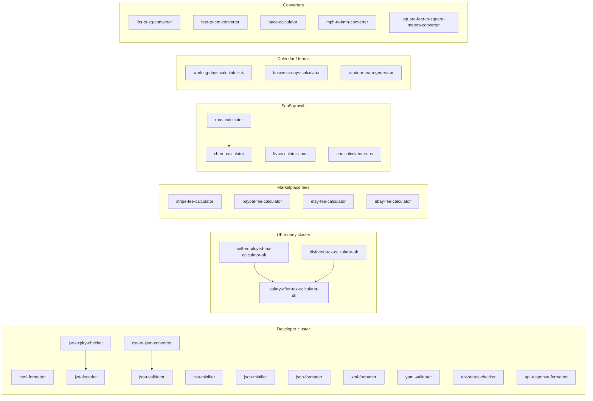

# Toollabz - Phase 2 tool expansion (strategy & delivery)

This document captures **implementation order**, **slugs**, **clusters**, **keywords**, **blog angles**, and **dedupes** for the “high-intent / low–medium competition” batch. Tool code ships in:

- `lib/tools/expansion-phase2-tool-definitions.ts` - definitions, FAQs, related
- `lib/tools/expansion-phase2-compute.ts` - `computeExpansionPhase2` (wired from `engine.ts` after Phase 1)
- `lib/tools/phase2-seo-expansion-batch2.ts` - merged into `content.ts` SEO profiles
- `lib/tools/insight-registry/registry-j.ts` - Tool Insight panel (required for coverage tests)

---

## Already on-site (skipped as new builds)

| Request | Existing slug / note |
|--------|----------------------|
| Salary after tax UK | `salary-after-tax-calculator-uk` |
| Markup calculator | `markup-calculator` |
| SaaS CAC | `cac-calculator-saas` |
| Timezone converter | `time-zone-converter` |
| CM to feet | `cm-to-feet` |
| KG to lbs | `kg-to-lbs` (inverse added as `lbs-to-kg-converter`) |
| Age calculator | `age-calculator` |
| Feet + inches ↔ cm | `feet-inches-to-cm-converter` (decimal feet variant added as `feet-to-cm-converter`) |
| ROAS (Google-branded) | `google-ads-roi-calculator` (generic `roas-calculator` added) |

---

## Implementation order (ship / internal priority)

1. **Developer text utilities** - fast deterministic SEO, low support burden: `html-formatter`, `css-minifier`, `json-minifier`, `xml-formatter`, `yaml-validator`, `csv-to-json-converter`
2. **Auth / API hygiene** - pairs with JWT + timestamp content: `jwt-expiry-checker`, `api-status-checker` (honest: sync URL + curl helper, no live fetch)
3. **UK finance sketches** - YMYL-safe “effective %” pattern: `self-employed-tax-calculator-uk`, `dividend-tax-calculator-uk`
4. **Marketplace fees** - long-tail monetization intent: `stripe-fee-calculator`, `paypal-fee-calculator`, `etsy-fee-calculator`, `ebay-fee-calculator`
5. **SaaS / growth metrics** - cluster with LTV/CAC: `churn-calculator`, `roas-calculator`
6. **Calendar / ops** - payroll + SLA: `working-days-calculator-uk`, `business-days-calculator`, `random-team-generator`
7. **Converters** - thin pages but strong utility: `lbs-to-kg-converter`, `feet-to-cm-converter`, `pace-calculator`, `mph-to-kmh-converter`, `square-feet-to-square-meters-converter`

---

## Slugs × category × primary keyword

| Slug | Category | Primary keyword (intent) |
|------|----------|---------------------------|
| `html-formatter` | developer | html formatter online |
| `css-minifier` | developer | css minifier online |
| `json-minifier` | developer | json minifier online |
| `xml-formatter` | developer | xml formatter online |
| `yaml-validator` | developer | yaml validator online |
| `csv-to-json-converter` | developer | csv to json online |
| `jwt-expiry-checker` | developer | jwt expiry checker |
| `api-status-checker` | developer | api url validator curl |
| `self-employed-tax-calculator-uk` | finance | self employed tax calculator uk |
| `dividend-tax-calculator-uk` | finance | dividend tax calculator uk |
| `stripe-fee-calculator` | finance | stripe fee calculator |
| `paypal-fee-calculator` | finance | paypal fee calculator |
| `etsy-fee-calculator` | finance | etsy fee calculator |
| `ebay-fee-calculator` | finance | ebay fee calculator |
| `churn-calculator` | business | churn calculator saas |
| `roas-calculator` | marketing | roas calculator |
| `working-days-calculator-uk` | utility | working days calculator uk |
| `business-days-calculator` | utility | business days calculator |
| `random-team-generator` | utility | random team generator |
| `lbs-to-kg-converter` | converters | lbs to kg converter |
| `feet-to-cm-converter` | converters | feet to cm converter |
| `pace-calculator` | converters | pace calculator |
| `mph-to-kmh-converter` | converters | mph to kmh converter |
| `square-feet-to-square-meters-converter` | converters | square feet to square meters |

---

## Cluster map (topical authority)

**Internal linking pattern:** each tool’s `related` array points within its cluster + one “hub” neighbor (`json-validator`, `salary-after-tax-calculator-uk`, `stripe-fee-calculator`, `ltv-calculator-saas`, `date-difference-calculator`, `km-to-miles`). Blog posts can add `relatedToolSlugs` for 5–12 contextual links per article.

---

## Blog map (3–5 ideas per cluster) + target keywords

### Developer

| # | Topic | Target keywords |
|---|--------|-----------------|
| 1 | When to minify JSON/CSS in the browser vs build pipeline | json minify production, css minify ci |
| 2 | CSV → JSON for API mocks: quoting and typing pitfalls | csv to json api prototype |
| 3 | YAML validation before `helm upgrade`: what parsers catch | yaml validator helm, kubernetes yaml syntax |
| 4 | JWT `exp` vs server clock skew runbooks | jwt exp skew, session timeout debugging |
| 5 | Honest “API status” checks: curl vs browser CORS | curl api health check, cors vs curl |

### UK finance (effective % tools)

| # | Topic | Target keywords |
|---|--------|-----------------|
| 1 | Sole trader reserves: blending NI + income tax in one % | self employed tax estimate uk |
| 2 | Dividend tax allowances: why we use “effective %” inputs | uk dividend tax calculator planning |
| 3 | Self-employed vs PAYE: when to use salary-after-tax UK | take home pay uk comparison |

### Marketplace fees

| # | Topic | Target keywords |
|---|--------|-----------------|
| 1 | Stripe balance transactions: percent + fixed intuition | stripe fees explained |
| 2 | Etsy true net: listing + transaction + payment stack | etsy seller fees breakdown |
| 3 | eBay managed payments vs old PayPal mental model | ebay final value fee estimate |

### SaaS metrics

| # | Topic | Target keywords |
|---|--------|-----------------|
| 1 | Compound churn vs cohort charts (when the shortcut lies) | monthly churn formula |
| 2 | ROAS vs ROI vs MER for paid media reporting | roas vs roi marketing |

### Utilities

| # | Topic | Target keywords |
|---|--------|-----------------|
| 1 | UK payroll weekdays without embedding bank holidays | working days calculator uk payroll |
| 2 | SLA “business days” inclusive vs exclusive | business days between dates |

### Converters

| # | Topic | Target keywords |
|---|--------|-----------------|
| 1 | lbs ↔ kg for shipping labels vs bodyweight | pounds to kg exact |
| 2 | Decimal feet for CAD vs feet-inches for humans | feet to cm engineering |
| 3 | Pace: GPS distance vs certified course distance | race pace calculator |

---

## SEO opportunity notes

- **Prefer long-tail slugs and copy** over head terms (“JSON minifier” not “JSON”).
- **YMYL**: UK tax tools are explicitly “sketch / effective %” - no HMRC impersonation; FAQs say accountant + official software for filing.
- **`api-status-checker`**: positioned as **URL validation + curl probe** to avoid promising live HTTP inside sync `computeTool` (keeps tests and architecture honest).
- **Dependencies**: `yaml` package added for `yaml-validator` - keep version pinned in `package.json`.
- **Freshness**: bump `SITE_LAST_UPDATED` / changelog if your site uses them for freshness signals.

---

## QA checklist (already automated where noted)

- [x] `npm test` - engine, system integrity, SERP metadata, tool insights uniqueness
- [x] `valueOverrides` in `tests/system-integrity.test.ts` for text/select edge defaults
- [ ] Optional: `npm run lint` / `npx tsc --noEmit` in CI
- [ ] Optional: add blog articles with `relatedToolSlugs` pointing at Phase 2 slugs for topical reinforcement

---

## Next consolidation phase (suggested)

1. Publish **one hub article per cluster** (Developer utilities, UK tax sketches, Marketplace fees, SaaS metrics) interlinking 8–12 tools each.
2. Reciprocal `related` tuning after GSC shows impressions (avoid over-stuffing).
3. Programmatic **country fee** variants only if analytics show demand (avoid thin duplicates).
